# Jason's DGX Cluster Guide

### 2-Node Distributed Training Cluster with 200 Gb/s Direct Attach

> Two NVIDIA DGX Spark systems (Grace Blackwell GB10) connected point-to-point over a 200 Gb/s ConnectX-7 RoCEv2 fabric link — no InfiniBand switch required. Achieving **93.5% DDP scaling efficiency** and **1.87x epoch speedup** on distributed Llama training.

---

<table>
<tr>
<td width="50%">

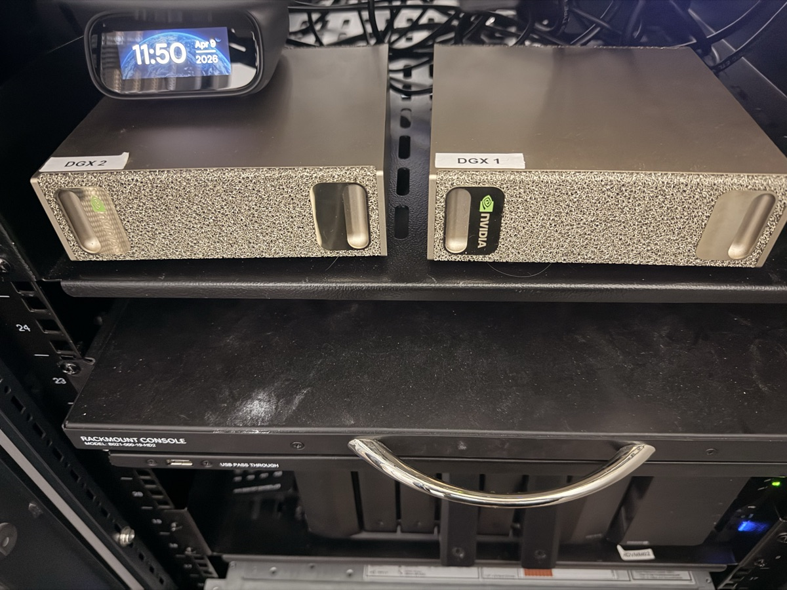
<p align="center"><em>DGX Spark 1 & 2 — front view, rack-mounted</em></p>

</td>
<td width="50%">

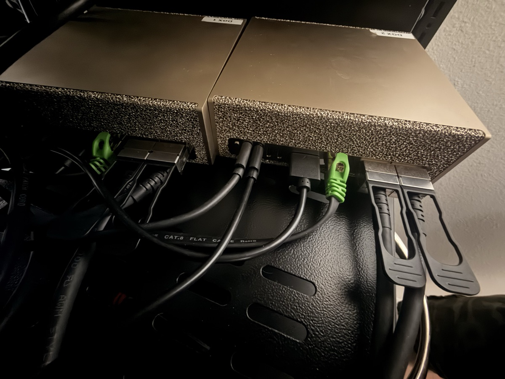
<p align="center"><em>Rear cabling — direct fabric + LAN connections</em></p>

</td>
</tr>
</table>

---

## Guides

### Getting Started
- [Cluster Overview](docs/00-cluster-overview.md) — Full hardware inventory, IP addresses, mount points, health checks
- [Network Setup](docs/01-network-setup.md) — Physical cabling, OFED drivers, netplan config, SSH, bandwidth testing
- [INSTALL.md](INSTALL.md) — Mac → GitHub push steps + LLM system context block you can paste into any local model

### Training
- [Distributed Training](docs/02-distributed-training.md) — NCCL configuration, GID index, launcher walkthrough, performance numbers
- [Training Pipeline](docs/05-training-pipeline.md) — End-to-end: data prep → distributed train → merge LoRA → evaluate
- [GPU Direct RDMA](docs/04-gpu-direct-rdma.md) — Why nvidia-peermem fails, DMA-BUF solution, safe vs. dmabuf modes

### Inference
- [Exo Model Serving (CPU/General)](docs/06-exo-model-serving.md) — Overview, CPU inference, shared model storage, OpenAI-compatible API
- [Exo CUDA/Tinygrad Setup](docs/07-exo-cuda-tinygrad.md) — **Working** GPU-accelerated inference with EXO v0.0.9-alpha + tinygrad on CUDA

### Storage
- [ROSE Server Setup](docs/rosa/01-rosa-server-setup.md) — RouterOS NVMe-TCP targets, RAID pools, subsystems, host ACLs
- [Spark Initiator Setup](docs/rosa/02-spark-initiator-setup.md) — NVMe-TCP client, kernel module, mount, fstab, systemd auto-connect
- [Storage Performance](docs/rosa/03-performance-testing.md) — Benchmarks: `dd`, `fio`, NVMe-TCP vs. NFS vs. local

### Scaling
- [Expanding to 3-10 Nodes](#scaling-beyond-2-nodes) — Switch requirements, IP addressing, NCCL tuning, rendezvous launch, storage bandwidth

### Troubleshooting
- [Troubleshooting Guide](docs/03-troubleshooting.md) — Training hangs, connection timeouts, missing IB devices, wrong NIC, port state

### Config Files
- [`configs/nccl-env.sh`](configs/nccl-env.sh) — NCCL environment (two modes: `safe` / `dmabuf`)
- [`configs/netplan-node0.yaml`](configs/netplan-node0.yaml) / [`netplan-node1.yaml`](configs/netplan-node1.yaml) — Network config per node
- [`configs/nvme-rosa-connect.service`](configs/nvme-rosa-connect.service) — Systemd unit for NVMe-TCP auto-connect
- [`configs/fstab-entries.txt`](configs/fstab-entries.txt) — fstab lines for ROSE volume mounts
- [`training/requirements.txt`](training/requirements.txt) — Python dependencies

---

## What This Solves

Grace Blackwell's unified memory architecture does **not** support GPU Direct RDMA (GDR). Every guide and default NCCL setting assumes GDR works — on this hardware, it causes `dist.init_process_group()` to hang indefinitely with no error message.

This repo provides the **tested, working configuration** for distributed PyTorch training on DGX Spark, including the NCCL environment variables, network setup, launcher scripts, and benchmarks that took significant trial-and-error to get right.

---

## Cluster Architecture

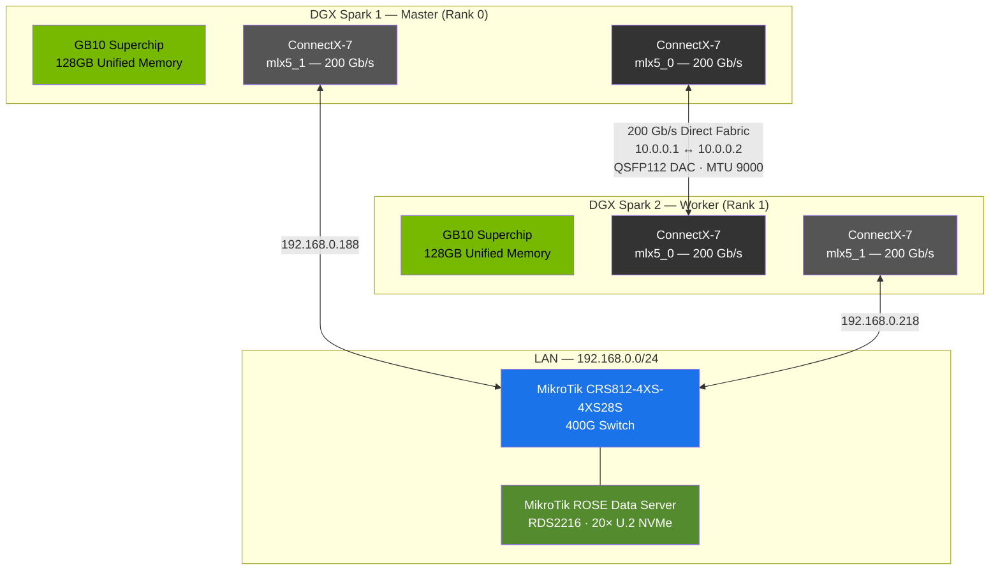

### Data Flow During Training

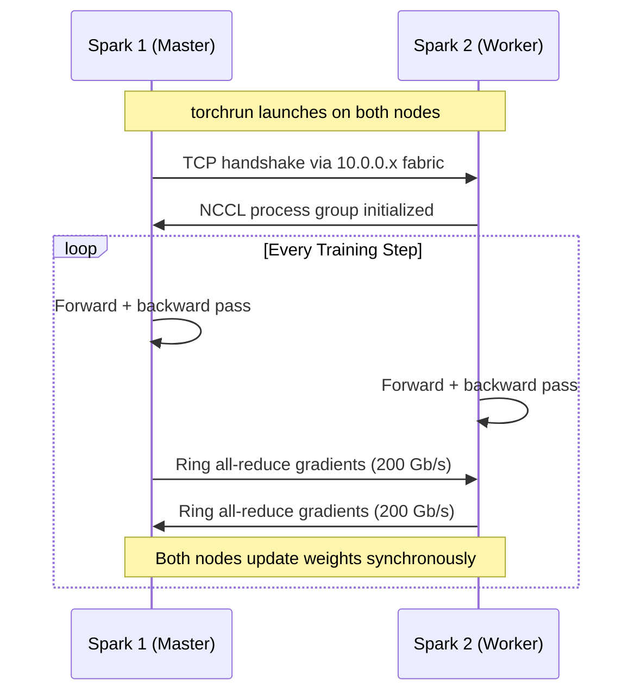

---

## Network Infrastructure

<table>
<tr>
<td width="50%">

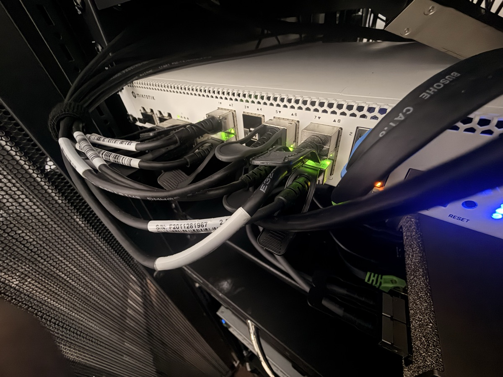
<p align="center"><em>MikroTik CRS812 — 400G switch with QSFP56-DD uplinks</em></p>

</td>
<td width="50%">

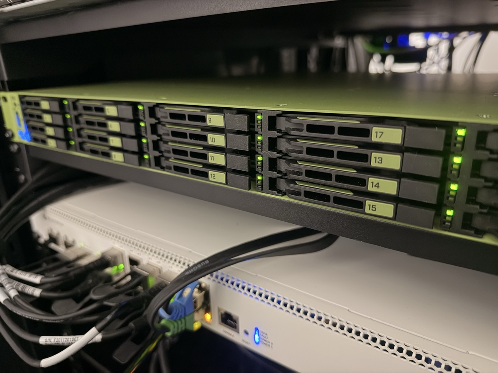
<p align="center"><em>MikroTik ROSE Data Server (RDS2216) — 20x U.2 NVMe, NVMe-TCP</em></p>

</td>
</tr>
</table>

<p align="center">
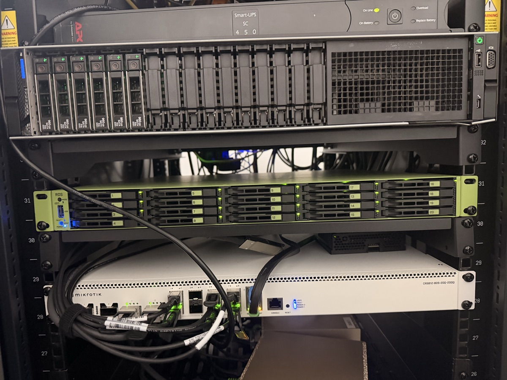
<br><em>Full rack — Dell R750, ROSE Data Server (RDS2216), and CRS812 400G switch</em>
</p>

### Storage & Network Path

The DGX Sparks connect through the CRS812 400G switch to reach the ROSE Data Server, which exports its 20x U.2 NVMe drives over NVMe-TCP for shared high-speed storage across both training nodes.

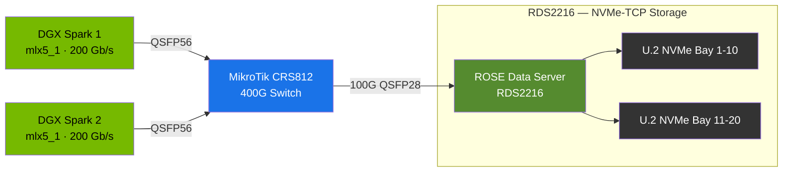

### Interface Map (per node)

| Interface | Device | Speed | IP Address | Role |
|-----------|--------|-------|------------|------|
| `enp1s0f0np0` | `mlx5_0` | 200 Gb/s | `10.0.0.x/24` | **Direct fabric (NCCL)** |
| `enp1s0f1np1` | `mlx5_1` | 200 Gb/s | `192.168.0.x/24` | LAN / default route |
| `enP2p1s0f0np0` | `mlx5_2` | 200 Gb/s | — | Available |
| `enP2p1s0f1np1` | `mlx5_3` | 200 Gb/s | `192.168.0.x/24` | Secondary LAN |
| `enP7s7` | — | 10 Gb/s | `192.168.0.x/24` | Management |

---

## Setup Guide

### Prerequisites

| Component | Version |
|-----------|---------|
| OS | DGX Spark OS 7.5.0 (Ubuntu 22.04 aarch64) |
| CUDA | 12.4+ |
| Mellanox OFED | 24.07 |
| Python | 3.8+ |
| Cable | QSFP112 200 Gb/s DAC or AOC |

### Step 1 — Install Python Dependencies

```bash
pip3 install torch torchvision torchaudio --index-url https://download.pytorch.org/whl/cu124
pip3 install -r training/requirements.txt
```

### Step 2 — Configure Network (both nodes)

**On spark-dgx-1 (Node 0):**

```bash
sudo cp configs/netplan-node0.yaml /etc/netplan/99-dgx-cluster.yaml
sudo chmod 600 /etc/netplan/99-dgx-cluster.yaml
sudo netplan apply
```

**On spark-dgx-2 (Node 1):**

```bash
sudo cp configs/netplan-node1.yaml /etc/netplan/99-dgx-cluster.yaml
sudo chmod 600 /etc/netplan/99-dgx-cluster.yaml
sudo netplan apply
```

> The netplan configs set **MTU 9000** (jumbo frames) on all interfaces. Make sure your CRS812 switch ports are also set to MTU 9000 — mismatched MTU causes silent packet drops and degraded throughput.
>
> See [`configs/netplan-node0.yaml`](configs/netplan-node0.yaml) and [`configs/netplan-node1.yaml`](configs/netplan-node1.yaml) for the full network configuration.

### Step 3 — Set Up Passwordless SSH

```bash
# On spark-dgx-1
ssh-keygen -t ed25519 -f ~/.ssh/id_ed25519 -N ""
ssh-copy-id user@10.0.0.2

# On spark-dgx-2
ssh-keygen -t ed25519 -f ~/.ssh/id_ed25519 -N ""
ssh-copy-id user@10.0.0.1
```

### Step 4 — Verify Everything

```bash
./scripts/verify_network_setup.sh
```

This checks: InfiniBand device detection, interface status, cross-node ping, passwordless SSH, and PyTorch/CUDA/NCCL availability.

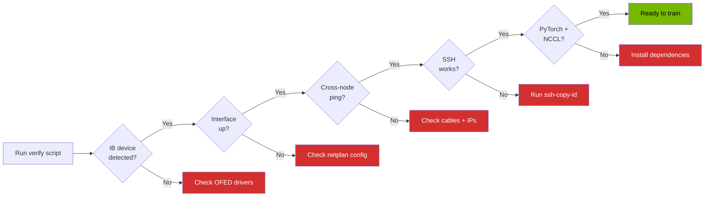

---

## Running Distributed Training

### Source NCCL Environment

Before any training run, source the NCCL configuration on **both nodes**:

```bash
# Safe mode (default) — always works, CPU-staged RDMA (~18-20 GB/s)
source configs/nccl-env.sh safe

# DMA-BUF GPU Direct — max performance, zero-copy (~22-23 GB/s)
source configs/nccl-env.sh dmabuf
```

> Start with `safe` to verify training works, then switch to `dmabuf` for production.
> See [`configs/nccl-env.sh`](configs/nccl-env.sh) for details and [`docs/04-gpu-direct-rdma.md`](docs/04-gpu-direct-rdma.md) for the full GPU Direct investigation.

### Launch Training

**Single command (from spark-dgx-1 — SSHes to node 1, clears stale ports, launches both):**

```bash
# Full pipeline: data prep → train with eval → merge LoRA → done
./scripts/launch_cluster.sh training/train_pipeline.py \
    --model meta-llama/Llama-3.2-3B-Instruct \
    --train-data /mnt/rosa-storage/data/train.jsonl \
    --val-data /mnt/rosa-storage/data/val.jsonl \
    --output-dir /mnt/rosa-models/my-model-v1 \
    --epochs 3

# With DMA-BUF GPU Direct:
NCCL_MODE=dmabuf ./scripts/launch_cluster.sh training/train_pipeline.py [args]

# Smoke test:
./scripts/launch_cluster.sh training/validate_distributed.py
```

| Pipeline Stage | Who runs it | What it does |
|---|---|---|
| 1. Data prep | Rank 0 only | Validates files, tokenizes, creates output dir, barrier |
| 2. Train | Both nodes | DDP fine-tuning with LoRA, auto-checkpoints |
| 3. Eval | Both nodes | Runs during training via HF Trainer |
| 4. Merge | Rank 0 only | `merge_and_unload()` → full model in `merged/` |

**Or manual two-node launch:**

```bash
./scripts/distributed_train.sh 0 training/benchmark_train.py --epochs 3  # spark-dgx-1
./scripts/distributed_train.sh 1 training/benchmark_train.py --epochs 3  # spark-dgx-2
```

### Single-Node Training (local NVMe)

```bash
./scripts/launch_local_training.sh
```

> See [`docs/05-training-pipeline.md`](docs/05-training-pipeline.md) for the complete pipeline: data prep → distributed training → evaluation, showing which steps run on one node vs. both.

---

## Serving Large Models with Exo

For models that don't fit in a single Spark's 128 GB (e.g., Llama 405B at ~200 GB), [Exo](https://github.com/exo-explore/exo) shards the model across both nodes with automatic discovery:

```bash
# Install and start on BOTH nodes
cd /opt/exo && uv run exo

# Query via OpenAI-compatible API
curl http://192.168.0.188:52415/v1/chat/completions \
  -H "Content-Type: application/json" \
  -d '{"model": "llama-3.1-405b-4bit", "messages": [{"role": "user", "content": "Hello"}]}'
```

> Full setup: [`docs/06-exo-model-serving.md`](docs/06-exo-model-serving.md) — installation, shared model storage on ROSE, GPU acceleration via tinygrad fork, systemd service, and vLLM as an alternative.

---

## Benchmarks

```bash
# List all available benchmark scenarios
python3 training/run_benchmark.py --list

# Run all scenarios (single-node + distributed)
python3 training/run_benchmark.py --scenario all

# Run a specific scenario
python3 training/run_benchmark.py --scenario single_local
python3 training/run_benchmark.py --scenario single_rosa
python3 training/run_benchmark.py --scenario distributed_rosa
```

Scenarios are defined in [`training/configs.yaml`](training/configs.yaml). Default model: `meta-llama/Llama-3.2-3B-Instruct` with LoRA rank 32, 4-bit quantization, 50 steps per run.

### Measured Results

| Metric | Value |
|--------|-------|
| Fabric RTT (ping) | ~0.12 ms |
| RDMA bandwidth (`ib_write_bw`) | ~185-195 Gb/s |
| NCCL practical throughput | ~23-24 GB/s |
| Llama-2-7B epoch speedup | **1.87x** (single → dual node) |
| DDP scaling efficiency | **93.5%** |

---

## NCCL Configuration — Two Modes

The `nccl-env.sh` script supports two modes. The legacy `nvidia-peermem` GPU Direct approach does **not** work on this hardware (ARM64 kernel missing `ib_register_peer_memory_client` symbols) — DMA-BUF is the replacement.

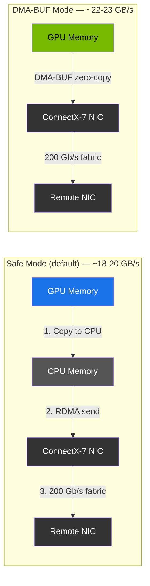

| | Safe Mode (`safe`) | DMA-BUF Mode (`dmabuf`) |
|---|---|---|
| **Command** | `source configs/nccl-env.sh safe` | `source configs/nccl-env.sh dmabuf` |
| **NCCL_NET_GDR_LEVEL** | `0` | `5` |
| **NCCL_DMABUF_ENABLE** | `0` | `1` |
| **Data path** | GPU → CPU RAM → RDMA NIC | GPU → RDMA NIC (zero-copy) |
| **Bandwidth** | ~18-20 GB/s | ~22-23 GB/s |
| **CPU overhead** | High | Near zero |
| **Requirements** | Any driver | Open NVIDIA driver 580+, kernel 6.x |
| **When to use** | First-time setup, debugging | Production training |

### Shared Settings (both modes)

| Variable | Value | Why |
|----------|-------|-----|
| `NCCL_IB_HCA` | `mlx5_0` | Pin to direct fabric CX7 port |
| `NCCL_SOCKET_IFNAME` | `enp1s0f0np0` | Direct fabric NIC |
| `NCCL_IB_GID_INDEX` | `3` | RoCEv2 GID (verify with `show_gids`) |
| `NCCL_ALGO` | `Ring` | Optimal for 2-node topology |
| `NCCL_IB_TIMEOUT` | `22` | Grace Blackwell init is slower |
| `NCCL_TIMEOUT` | `600` | 10-min overall timeout |

> Full investigation: [`docs/04-gpu-direct-rdma.md`](docs/04-gpu-direct-rdma.md) — why nvidia-peermem fails, DMA-BUF solution, how to verify

---

## ROSE NVMe-TCP Shared Storage

The [MikroTik ROSE Data Server (RDS2216)](https://mikrotik.com/product/rds2216) exports its U.2 NVMe drives as **block devices over TCP** — no NFS overhead, no FUSE, just raw block I/O over the network. Both DGX Sparks mount the same volumes, giving them shared access to training data and model weights.

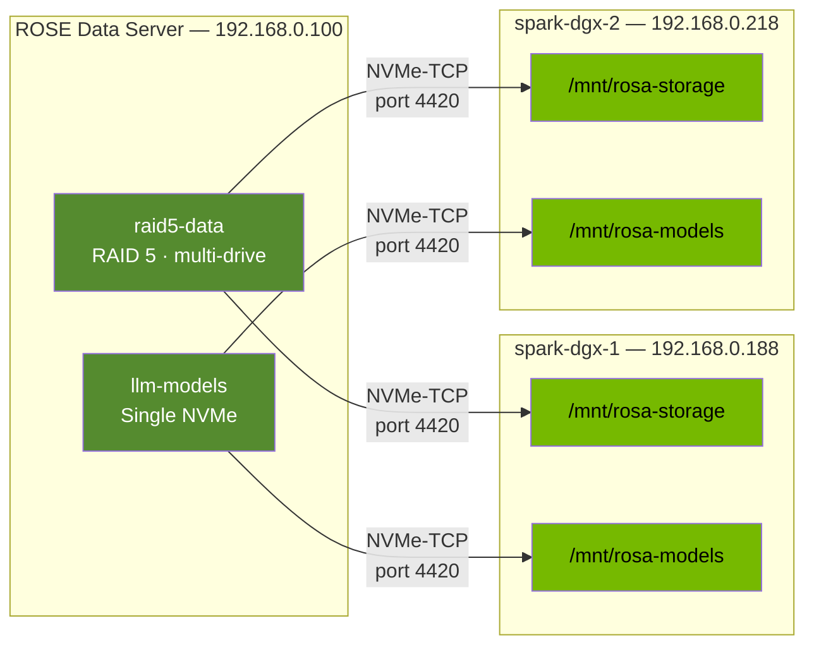

### Mount Points (both Sparks)

| Block Device | NVMe Subsystem | Mount Point | Use |
|---|---|---|---|
| `/dev/nvme1n1` | `raid5-data` | `/mnt/rosa-storage` | Training datasets |
| `/dev/nvme3n1` | `llm-models` | `/mnt/rosa-models` | Model weights / checkpoints |

### Quick Setup (per Spark)

```bash
# 1. Load NVMe-TCP kernel module (persist across reboots)
sudo modprobe nvme-tcp
echo "nvme-tcp" | sudo tee /etc/modules-load.d/nvme-tcp.conf

# 2. Discover available subsystems
nvme discover -t tcp -a 192.168.0.100 -s 4420

# 3. Connect to both volumes
sudo nvme connect -t tcp -n raid5-data -a 192.168.0.100 -s 4420
sudo nvme connect -t tcp -n llm-models -a 192.168.0.100 -s 4420

# 4. Create mount points and mount
sudo mkdir -p /mnt/rosa-storage /mnt/rosa-models
sudo mount /dev/nvme1n1 /mnt/rosa-storage
sudo mount /dev/nvme3n1 /mnt/rosa-models

# 5. Verify
df -h | grep rosa
```

### Auto-Connect at Boot

Install the systemd service so volumes reconnect and mount automatically:

```bash
sudo cp configs/nvme-rosa-connect.service /etc/systemd/system/
sudo systemctl daemon-reload
sudo systemctl enable nvme-rosa-connect.service
```

Then add the fstab entries (see [`configs/fstab-entries.txt`](configs/fstab-entries.txt)):

```bash
# Append to /etc/fstab
/dev/nvme1n1  /mnt/rosa-storage  ext4  defaults,noatime,_netdev  0  2
/dev/nvme3n1  /mnt/rosa-models   ext4  defaults,noatime,_netdev  0  2
```

### Storage Performance Comparison

| Storage Path | Protocol | Read | Write |
|---|---|---|---|
| Local NVMe (internal) | PCIe | 6,000+ MB/s | 4,000+ MB/s |
| **ROSE via LAN** | **NVMe-TCP** | **1,000–2,500 MB/s** | **800–1,500 MB/s** |
| ROSE via dedicated 100G | NVMe-TCP | 8,000–10,000 MB/s | 5,000–8,000 MB/s |
| Dell R750 NFS (20G bond) | NFS v4.2 | ~580 MB/s | ~300 MB/s |

> Full setup details: [`docs/rosa/01-rosa-server-setup.md`](docs/rosa/01-rosa-server-setup.md) (RouterOS config) | [`docs/rosa/02-spark-initiator-setup.md`](docs/rosa/02-spark-initiator-setup.md) (Spark client setup) | [`docs/rosa/03-performance-testing.md`](docs/rosa/03-performance-testing.md) (benchmarks)

---

## Full Cluster Topology

Every piece of hardware in the rack and how they interconnect:

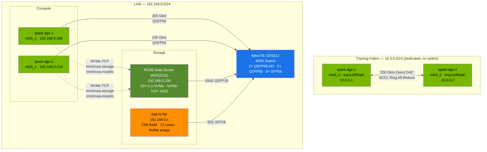

> **Key insight:** Training traffic (NCCL all-reduce) flows over the **dedicated 200 Gb/s direct fabric** (10.0.0.0/24) and never touches the LAN switch. Storage I/O (NVMe-TCP to ROSE) and management traffic flow through the **CRS812 on the LAN** (192.168.0.0/24). These are completely independent paths — storage I/O cannot bottleneck gradient sync.

---

## Repo Structure

```
dgx-spark-direct-fabric/
├── INSTALL.md                         # Mac → GitHub push steps + LLM system context block
├── configs/
│   ├── nccl-env.sh                    # NCCL env — two modes: safe / dmabuf
│   ├── netplan-node0.yaml             # Network config for spark-dgx-1
│   ├── netplan-node1.yaml             # Network config for spark-dgx-2
│   ├── nvme-rosa-connect.service      # Systemd unit — auto-connect ROSE NVMe-TCP at boot
│   └── fstab-entries.txt              # fstab lines for ROSE volume mounts
├── docs/
│   ├── 00-cluster-overview.md         # Full topology, IP reference, mount points, health checks
│   ├── 01-network-setup.md            # Physical setup, drivers, IP config
│   ├── 02-distributed-training.md     # NCCL deep-dive, performance tuning
│   ├── 03-troubleshooting.md          # Diagnostic checklist, common fixes
│   ├── 04-gpu-direct-rdma.md          # nvidia-peermem failure, DMA-BUF solution, verification
│   ├── 05-training-pipeline.md        # End-to-end: data prep → train → eval (what runs where)
│   ├── 06-exo-model-serving.md        # Exo setup for serving large models across both Sparks
│   └── rosa/
│       ├── 01-rosa-server-setup.md    # RouterOS NVMe-TCP target config
│       ├── 02-spark-initiator-setup.md # Spark NVMe-TCP client setup
│       └── 03-performance-testing.md   # Storage benchmarks & comparison
├── img/                               # Hardware photos
├── scripts/
│   ├── launch_cluster.sh             # One-command launcher (SSH, port cleanup, both nodes)
│   ├── launch_distributed.sh         # Simpler single-command launcher
│   ├── distributed_train.sh          # Manual 2-node torchrun launcher
│   ├── verify_network_setup.sh       # Pre-flight network validation
│   └── launch_local_training.sh      # Single-node local storage launcher
└── training/
    ├── train_pipeline.py              # 4-stage pipeline (data prep → train → eval → merge)
    ├── ddp_training_template.py       # Production DDP template (DistributedSampler, checkpoints)
    ├── validate_distributed.py        # NCCL smoke test (allreduce, latency, bandwidth sweep)
    ├── test_gpudirect_dmabuf.py       # GPU Direct / DMA-BUF preflight check
    ├── benchmark_train.py             # SFTTrainer benchmark (LoRA + 4-bit quant)
    ├── run_benchmark.py               # Benchmark orchestrator (SSH multi-node)
    ├── requirements.txt               # Python dependencies
    ├── configs.yaml                   # Benchmark scenario definitions
    └── run_manual_distributed.sh      # Manual torchrun command generator
```

---

## Hardware Specs

| Component | Specification |
|-----------|---------------|
| **System** | 2x NVIDIA DGX Spark |
| **CPU** | NVIDIA Grace (ARM aarch64) |
| **GPU** | GB10 Superchip (Blackwell) |
| **Memory** | 128 GB unified per node (256 GB total) |
| **NICs** | 4x ConnectX-7 @ 200 Gb/s each per node |
| **Fabric** | Direct 200 Gb/s QSFP112 (RoCEv2) |
| **Switch** | [MikroTik CRS812-4XS-4XS28S](https://mikrotik.com/product/crs812_ddq) — 400G, 2x QSFP56-DD + 2x QSFP56 + 8x SFP56 |
| **Storage** | [MikroTik ROSE Data Server (RDS2216)](https://mikrotik.com/product/rds2216) — 20x U.2 NVMe, 2x 100G QSFP28, NVMe-TCP |
| **OS** | DGX Spark OS 7.5.0 — Ubuntu 22.04 LTS |
| **Kernel** | Linux 6.17.0-1014-nvidia aarch64 |
| **OFED** | Mellanox OFED 24.07 |

---

## Scaling Beyond 2 Nodes

This guide starts with a direct-attach 2-node cluster (no switch needed for the training fabric). Here's how to scale to 3, 4, and beyond.

### What Changes at Each Scale

| Nodes | Fabric Topology | What You Need | NCCL Changes |
|---|---|---|---|
| **2** | Direct DAC cable | Nothing extra (current setup) | `NCCL_ALGO=Ring` |
| **3-4** | InfiniBand switch | 1x IB/RoCE switch (e.g., MikroTik CRS812 or Mellanox SN2100) | `NCCL_ALGO=Ring` or `Tree` |
| **5-8** | IB switch + spine | 1-2x IB switches, leaf-spine if >1 switch | `NCCL_ALGO=Tree` |
| **9-10+** | Fat-tree fabric | Spine-leaf IB fabric, dedicated subnet manager | `NCCL_ALGO=Tree`, consider `NCCL_NCHANNELS` tuning |

### Step 1 — Add an InfiniBand / RoCE Switch for the Training Fabric

The direct DAC cable between two nodes can't scale beyond 2. For 3+ nodes, you need a switch on the training fabric (10.0.0.0/24).

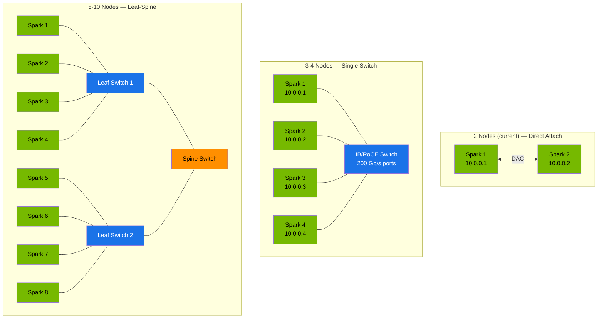

**Switch options for the training fabric:**

| Switch | Ports | Price Range | Notes |
|---|---|---|---|
| [MikroTik CRS812](https://mikrotik.com/product/crs812_ddq) | 2x 400G + 2x 200G + 8x 50G | ~$1,300 | Already in the rack for LAN — could repurpose or add a second |
| Mellanox SN2100 | 16x 100G | ~$2,000-4,000 used | Purpose-built for RDMA, great NCCL support |
| Mellanox SN2700 | 32x 100G | ~$3,000-6,000 used | For 5+ nodes |
| NVIDIA QM8700 | 36x 200G HDR | ~$5,000-10,000 used | Full 200G per port, native IB |

### Step 2 — Assign IPs to New Nodes

Extend the `10.0.0.0/24` fabric subnet. Create a netplan config for each new node:

```yaml
# /etc/netplan/99-dgx-cluster.yaml — Node N
network:
  version: 2
  ethernets:
    enp1s0f0np0:
      addresses:
        - 10.0.0.N/24    # N = node number (3, 4, 5, ...)
      mtu: 9000
```

| Node | Hostname | Fabric IP | LAN IP | Rank |
|---|---|---|---|---|
| 1 | spark-dgx-1 | 10.0.0.1 | 192.168.0.188 | 0 (master) |
| 2 | spark-dgx-2 | 10.0.0.2 | 192.168.0.218 | 1 |
| 3 | spark-dgx-3 | 10.0.0.3 | 192.168.0.x | 2 |
| 4 | spark-dgx-4 | 10.0.0.4 | 192.168.0.x | 3 |
| ... | ... | ... | ... | ... |
| 10 | spark-dgx-10 | 10.0.0.10 | 192.168.0.x | 9 |

### Step 3 — Update NCCL Configuration

Edit `configs/nccl-env.sh` — most settings stay the same, but adjust:

```bash
# For 3-4 nodes, Ring is still good:
export NCCL_ALGO=Ring

# For 5+ nodes, Tree is usually faster:
export NCCL_ALGO=Tree

# If using a switch (not direct attach), you may need:
export NCCL_IB_HCA=mlx5_0          # Still pin to fabric NIC
export NCCL_SOCKET_IFNAME=enp1s0f0np0  # Still use fabric interface

# For larger clusters, increase parallelism:
export NCCL_NCHANNELS=8             # Default is 2; try 4-8 for more nodes
export NCCL_MIN_NCHANNELS=4
```

### Step 4 — Update Launch Scripts

Modify `scripts/launch_cluster.sh` or create a hostfile approach:

```bash
# hostfile for torchrun (one line per node)
cat > /tmp/hostfile << EOF
10.0.0.1 slots=1
10.0.0.2 slots=1
10.0.0.3 slots=1
10.0.0.4 slots=1
EOF

# Launch with torchrun using hostfile
python3 -m torch.distributed.run \
  --nnodes=4 \
  --nproc_per_node=1 \
  --rdzv_backend=c10d \
  --rdzv_endpoint=10.0.0.1:29500 \
  training/train_pipeline.py [args]
```

For 3+ nodes, switch from `--master_addr`/`--node_rank` to the **rendezvous** (`rdzv`) backend — it handles node discovery automatically:

```bash
# Run this SAME command on ALL nodes — no node_rank needed
python3 -m torch.distributed.run \
  --nnodes=4 \
  --nproc_per_node=1 \
  --rdzv_backend=c10d \
  --rdzv_endpoint=10.0.0.1:29500 \
  --rdzv_id=training-run-1 \
  training/train_pipeline.py [args]
```

### Step 5 — Shared Storage Scaling

The ROSE Data Server handles shared storage for all nodes. Each new Spark needs:

```bash
# Install NVMe-TCP client
sudo modprobe nvme-tcp
echo "nvme-tcp" | sudo tee /etc/modules-load.d/nvme-tcp.conf

# Connect + mount (same commands as existing nodes)
sudo nvme connect -t tcp -n raid5-data -a 192.168.0.100 -s 4420
sudo nvme connect -t tcp -n llm-models -a 192.168.0.100 -s 4420
sudo mkdir -p /mnt/rosa-storage /mnt/rosa-models
sudo mount /dev/nvme1n1 /mnt/rosa-storage
sudo mount /dev/nvme3n1 /mnt/rosa-models

# Install systemd service + fstab (same as existing nodes)
sudo cp configs/nvme-rosa-connect.service /etc/systemd/system/
sudo systemctl daemon-reload && sudo systemctl enable nvme-rosa-connect.service
```

> **Storage bandwidth consideration:** With 10 nodes all reading from ROSE over the LAN, the 100G QSFP28 links become the bottleneck (~10 GB/s shared). Options:
> - Bond both ROSE QSFP28 ports for 200G aggregate
> - Use the dedicated 100G ports on each Spark for a separate storage fabric
> - Stage training data to local NVMe before training begins

### Scaling Quick Reference

| Cluster Size | Aggregate Compute | Aggregate Memory | Expected DDP Efficiency | NCCL Algorithm |
|---|---|---|---|---|
| 2 nodes | 2 petaflops | 256 GB | ~93-95% | Ring |
| 4 nodes | 4 petaflops | 512 GB | ~90-93% | Ring or Tree |
| 8 nodes | 8 petaflops | 1 TB | ~85-90% | Tree |
| 10 nodes | 10 petaflops | 1.28 TB | ~80-88% | Tree |

> DDP efficiency drops as nodes increase due to gradient sync overhead. The 200 Gb/s fabric keeps this manageable — the bottleneck shifts to the switch bisection bandwidth at 8+ nodes.

---

## References

- [NVIDIA NCCL Documentation](https://docs.nvidia.com/deeplearning/nccl/)
- [PyTorch Distributed Training Guide](https://pytorch.org/tutorials/intermediate/dist_tuto.html)
- [NVIDIA DGX Spark User Guide](https://docs.nvidia.com/dgx/dgx-spark/)
- [MLNX OFED Documentation](https://docs.nvidia.com/networking/display/ofedv24070612)

---

<p align="center"><strong>Built by <a href="https://jasonbrashear.com">Jason Brashear</a></strong> · <a href="https://jasonbrashear.substack.com/">Substack</a> · <a href="https://github.com/jasonbrashear">GitHub</a> · <a href="https://twitter.com/JasonBrashearTX">@JasonBrashearTX</a></p>
